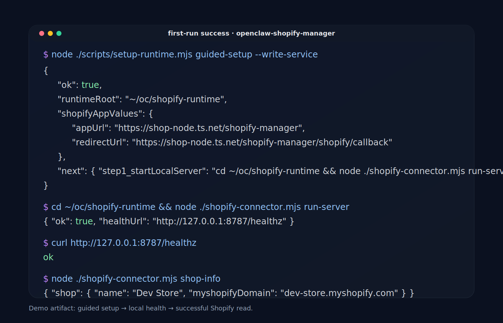

# openclaw-shopify-manager

[Available on ClawHub](https://clawhub.ai/skills/openclaw-shopify-manager) · [GitHub Releases](https://github.com/dave8172/openclaw-shopify-manager/releases) · [Project Page](https://dave8172-website.vercel.app/projects/openclaw-shopify-manager)

**Security-first Shopify access for OpenClaw.**

`openclaw-shopify-manager` gives OpenClaw a small localhost-bound Shopify connector with least-privilege OAuth, webhook signature validation, read-first store operations, and a practical deployment path for real hosts, VMs, and Docker installs.

If the goal is “install, point at a store, finish setup, then just ask for Shopify product information,” that is exactly the direction this skill should optimize for.

## Who this is for

Use this if you are:
- running OpenClaw and want Shopify access without a broad full-trust integration
- a builder/operator connecting a Shopify dev store or real store to OpenClaw
- security-conscious and want explicit local runtime files, explicit scopes, and explicit ingress

This is **not** a merchant-facing no-code app. It is a technical operator/developer tool.

## What makes it different

- **Least-privilege by default**: narrow scopes, read-first posture
- **Local connector**: small Node runtime, localhost bind by default
- **Verified callbacks/webhooks**: HMAC validation built in
- **Operationally boring**: simple files, simple service model, simple logs
- **Docker-aware**: supports host or sidecar deployment without pretending every environment is bare metal

## Current use cases

- connect a Shopify app to OpenClaw via OAuth
- store and use an offline Admin API token locally
- verify Shopify webhooks
- read shop info, products, blogs, and articles
- update products and content with explicit mutation controls
- deploy the connector cleanly with systemd, Tailscale, or a Docker sidecar

---

# Quickstart

## The near-zero-friction path

A true **single-click** install is not realistic because Shopify still requires a human to:
- create/configure the Shopify app
- paste the app key/secret
- approve the OAuth install in a browser

But the skill **can** be made close to one-click operationally:

1. install/import the skill
2. run one bootstrap command
3. fill Shopify app values
4. expose the callback URL
5. complete OAuth once
6. start using Shopify commands normally

That is the canonical flow this repo now supports.

## Canonical setup flow

After extracting or installing the skill bundle, use the bundled setup helper:

```bash
node ./scripts/setup-runtime.mjs guided-setup --write-service
```

The helper creates a canonical runtime folder with:

```text
~/oc/shopify-runtime/
  config.json
  .env
  shopify-connector.mjs
  shopify-connector.service   # when --write-service is used
  state/
  logs/
```

It also prints the exact next commands and the exact Shopify app values to use.

## Fast path example

If you already know your store domain and public HTTPS base URL:

```bash
node ./scripts/setup-runtime.mjs guided-setup \
  --shop your-store.myshopify.com \
  --public-base-url https://YOUR-TAILSCALE-HOSTNAME/shopify-manager \
  --api-key YOUR_API_KEY \
  --api-secret YOUR_API_SECRET \
  --write-service
```

Then:

```bash
cd ~/oc/shopify-runtime
node ./shopify-connector.mjs run-server
curl http://127.0.0.1:8787/healthz
node ./shopify-connector.mjs auth-url
```

Open the returned URL, approve the Shopify app install, and after callback completion the connector stores the offline token in `.env`.

Then verify:

```bash
cd ~/oc/shopify-runtime
node ./shopify-connector.mjs shop-info
node ./shopify-connector.mjs list-products --limit 10
```

At that point the skill is in the “setup done, use Shopify normally” state.

## First-run success artifact



Also included:
- transcript: `examples/first-run-success-transcript.md`
- screenshot asset: `examples/first-run-success.svg`

---

# 5-minute setup checklist

## 1) Install the skill

Get the latest packaged skill from GitHub Releases or ClawHub.

- GitHub Releases: <https://github.com/dave8172/openclaw-shopify-manager/releases>
- ClawHub listing: <https://clawhub.ai/skills/openclaw-shopify-manager>

If you are manually inspecting the package, remember that a `.skill` file is just a zip archive.

## 2) Bootstrap the runtime

Run the guided setup helper:

```bash
node ./scripts/setup-runtime.mjs guided-setup --write-service
```

If you prefer, pass values non-interactively:

```bash
node ./scripts/setup-runtime.mjs guided-setup --shop your-store.myshopify.com --public-base-url https://YOUR-HOST/shopify-manager
```

## 3) Configure the Shopify app

Use the values printed by the setup helper.

Typical values:

- **App URL**: `https://YOUR-HOST/shopify-manager`
- **Allowed redirection URL**: `https://YOUR-HOST/shopify-manager/shopify/callback`

You also need:
- `SHOPIFY_API_KEY`
- `SHOPIFY_API_SECRET`
- `SHOPIFY_SHOP=your-store.myshopify.com`

## 4) Start the local connector

```bash
cd ~/oc/shopify-runtime
node ./shopify-connector.mjs run-server
```

Health check:

```bash
curl http://127.0.0.1:8787/healthz
```

Expected response:

```text
ok
```

## 5) Expose it over HTTPS

Recommended path with Tailscale:

```bash
tailscale serve --https=443 /shopify-manager http://127.0.0.1:8787
tailscale funnel --https=443 on
```

Then verify the public health path.

## 6) Complete OAuth once

```bash
cd ~/oc/shopify-runtime
node ./shopify-connector.mjs auth-url
```

Open the returned URL, approve the install, and let Shopify redirect back to the configured callback URL.

## 7) Verify read-only access

```bash
cd ~/oc/shopify-runtime
node ./shopify-connector.mjs shop-info
node ./shopify-connector.mjs test
```

---

# What “1-click install” can realistically mean here

For this product, the right target is:

- **1-click skill install**
- **1-command runtime bootstrap**
- **1 obvious setup path**
- **1 canonical runtime directory**
- **1 OAuth approval step**
- **then normal OpenClaw usage**

That is realistic.

What is **not** realistic without a much larger hosted product:
- auto-creating the Shopify app inside a user’s store
- auto-filling secrets the user has not supplied
- bypassing Shopify’s install/consent flow
- making public HTTPS ingress appear magically without operator infrastructure

So the correct product strategy is not “pretend it is literally one click.”

It is:

**one install + one bootstrap + one setup flow + done**

---

# Using the connector after setup

The connector currently supports:

- `auth-url`
- `exchange-code`
- `run-server`
- `test`
- `shop-info`
- `list-products`
- `get-product`
- `update-product`
- `list-blogs`
- `list-articles`
- `create-article`
- `update-article`

Examples:

```bash
cd ~/oc/shopify-runtime
node ./shopify-connector.mjs shop-info
node ./shopify-connector.mjs list-products --limit 10
node ./shopify-connector.mjs get-product --id gid://shopify/Product/1234567890
```

Mutation examples remain explicit and controlled:

```bash
cd ~/oc/shopify-runtime
node ./shopify-connector.mjs update-product --id gid://shopify/Product/1234567890 --title "New title"
```

---

# Deployment guidance

## Best default: host or VM

Recommended shape:
- connector on host
- systemd on host
- Tailscale on host

Why:
- simplest service management
- easiest ingress model
- easiest local-vs-public networking story

## Good fallback: OpenClaw in Docker, connector on host

Recommended shape:
- OpenClaw in Docker
- connector on host
- Tailscale on host

Why:
- avoids forcing systemd into a container
- avoids mixing ingress, OpenClaw, and Shopify callback handling in one place

## Containerized fallback: sidecar connector

Recommended shape:
- OpenClaw container
- Shopify connector sidecar
- persistent mounted runtime volume
- host Tailscale or host reverse proxy

---

# Security posture

This skill intentionally stays narrow.

## It does

- generate Shopify OAuth install URLs
- exchange callback codes for offline tokens
- validate callback and webhook HMACs
- keep runtime state in a dedicated local directory
- default to read-first operational behavior

## It does not

- run remote installer shells
- hide broad privileged behavior behind “automation” language
- exfiltrate credentials
- create a public tunnel by itself
- pretend write actions are harmless

---

# Product improvement direction

To make this skill feel like a proper product, the next layers should be:

1. **better install UX**
   - now centered on `setup-runtime.mjs guided-setup`
2. **runtime doctor/validation UX**
   - supported by `setup-runtime.mjs doctor` with placeholder/callback checks
3. **canonical OpenClaw-side usage prompts**
   - “connect my Shopify store”, “list products”, “show store info”
4. **clear screenshots/demo transcript**
5. **release/listing copy optimized around the security-first angle**

---

# Development

## Repo checks

```bash
npm run check
```

## Package the skill

```bash
npm run package-skill
```

---

# Links

- Project page: <https://dave8172-website.vercel.app/projects/openclaw-shopify-manager>
- GitHub releases: <https://github.com/dave8172/openclaw-shopify-manager/releases>
- ClawHub listing: <https://clawhub.ai/skills/openclaw-shopify-manager>
